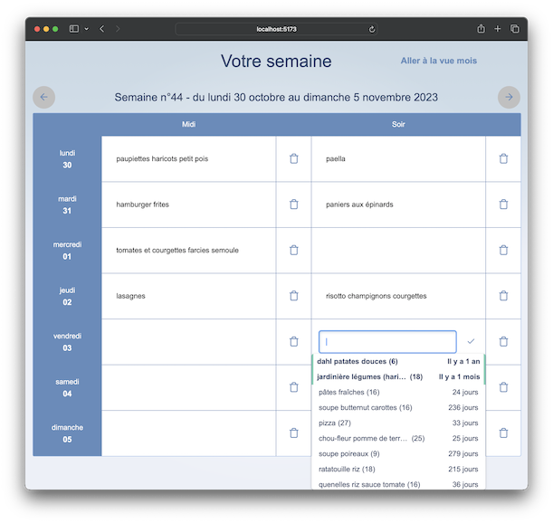
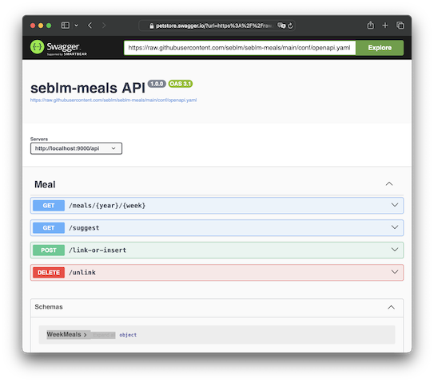

# seblm-meals

An application to quickly answer a simple question: what do we eat today?



Built with [Svelte] and [play].

## How to run

```shell
APPLICATION_UPDATE_DB=true docker compose up --detach
```

Go to http://localhost:9000 and you are good to go. Please note that `APPLICATION_UPDATE_DB=true` is only required for
the first time you start compose. Once schema is created, this configuration can be omitted.

It will start two containers:

1. a [postgres][docker-hub-postgres] database instance
2. the [Svelte/play][docker-hub-repository] web server instance

## API

There is an [openapi specification][openapi.yaml]. You can have a look with [Swagger UI][swagger-ui-demo].

[][swagger-ui-demo]

## How to build and run

Build frontend files:

```shell
docker run --rm --tty \
  --volume ./frontend:/home/node/seblm-meals \
  --user node --workdir /home/node/seblm-meals \
  node:22-alpine npm install
docker run --rm --tty \
  --volume ./frontend:/home/node/seblm-meals \
  --user node --workdir /home/node/seblm-meals \
  node:22-alpine npm run build
```

Generate a `Dockerfile` with sbt through Docker:

```shell
docker run --rm --tty \
  --volume .:/home/sbtuser/seblm-meals \
  --volume ~/Library/Caches/Coursier:/home/sbtuser/.cache/coursier \
  --user sbtuser --workdir /home/sbtuser/seblm-meals \
  sbtscala/scala-sbt:eclipse-temurin-21.0.5_11_1.10.6_3.5.2 sbt "Docker / stage"
```

Build with compose:

```shell
docker compose build
```

Then run compose:

```shell
APPLICATION_UPDATE_DB=true docker compose up --detach
```

## How to stop container:

```shell
docker compose stop
```

## How to backup database:

Please have a look to [specific documentation](backup/README.md).

## How to start application in dev mode

You need to have `npm` and `sbt` installed on your machine.

### Frontend

```shell
cd frontend
npm install
npm run dev
```

### Backend

Expose database by adding exposed ports into `compose.yaml`:

```yaml
services:
  database:
    ports:
      - 5432:5432
```

```shell
docker compose up database --detach
export POSTGRESQL_ADDON_USER=seblm-meals
export POSTGRESQL_ADDON_PASSWORD=seblm-database-password
export POSTGRESQL_ADDON_HOST=localhost
export POSTGRESQL_ADDON_DB=seblm-meals
sbt run
```

## Development

### Svelte

```shell
npm init svelte
```

```shell

> frontend@0.0.1 npx
> create-svelte


create-svelte version 6.3.7

┌  Welcome to SvelteKit!
│
◇  Where should we create your project?
│    (hit Enter to use current directory)
│
◇  Which Svelte app template?
│  ○ SvelteKit demo app (A demo app showcasing some of the features of SvelteKit - play a word guessing game that works without JavaScript!)
│  ● Skeleton project (Barebones scaffolding for your new SvelteKit app)
│  ○ Library project (Barebones scaffolding for your new Svelte library)
│
◇  Add type checking with TypeScript?
│  ● Yes, using TypeScript syntax
│  ○ Yes, using JavaScript with JSDoc comments
│  ○ No
│
◇  Select additional options (use arrow keys/space bar)
│  ◼ Add ESLint for code linting
│  ◼ Add Prettier for code formatting
│  ◻ Add Playwright for browser testing
│  ◻ Add Vitest for unit testing
│  ◻ Try the Svelte 5 preview (unstable!)
│
└  Your project is ready!

Install more integrations with:
  npx svelte-add

Next steps:
  1: npm install
  2: git init && git add -A && git commit -m "Initial commit" (optional)
  3: npm run dev -- --open

To close the dev server, hit Ctrl-C

Stuck? Visit us at https://svelte.dev/chat
```

[docker-hub-postgres]: https://hub.docker.com/_/postgres
[docker-hub-repository]: https://hub.docker.com/r/seblm/seblm-meals
[openapi.yaml]: conf/openapi.yaml
[play]: https://www.playframework.com
[Svelte]: https://svelte.dev
[swagger-ui-demo]: https://petstore.swagger.io/?url=https%3A%2F%2Fraw.githubusercontent.com%2Fseblm%2Fseblm-meals%2Fmain%2Fconf%2Fopenapi.yaml
