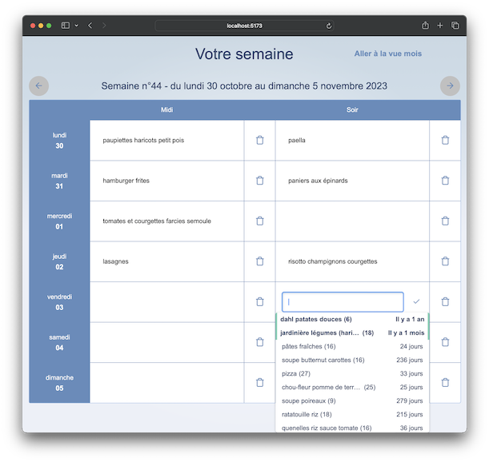
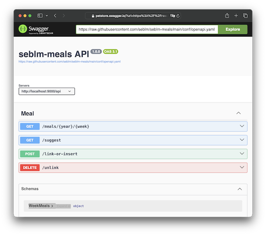

# seblm-meals

An application to quickly answer a simple question: what do we eat today?



Built with [Svelte] and [play].

## How to run

```shell
APPLICATION_UPDATE_DB=true docker compose up --detach
```

Go to http://localhost:9000 and you are good to go. Please note that `APPLICATION_UPDATE_DB=true` is only required for
the first time you start compose. Once schema is created, this configuration can be omitted.

It will start two containers:

1. a [postgres][docker-hub-postgres] database instance
2. the [Svelte/play][docker-hub-repository] web server instance

## API

There is an [openapi specification][openapi.yaml]. You can have a look with [Swagger UI][swagger-ui-demo].

[][swagger-ui-demo]

## How to build and run

Build frontend files:

```shell
docker run --rm --tty \
  --volume ./frontend:/home/node/seblm-meals \
  --user node --workdir /home/node/seblm-meals \
  node:24-alpine npm install
docker run --rm --tty \
  --volume ./frontend:/home/node/seblm-meals \
  --user node --workdir /home/node/seblm-meals \
  node:24-alpine npm run build
```

Generate a `Dockerfile` with sbt through Docker:

```shell
docker run --rm --tty \
  --volume .:/home/sbtuser/seblm-meals \
  --volume ~/Library/Caches/Coursier:/home/sbtuser/.cache/coursier \
  --user sbtuser --workdir /home/sbtuser/seblm-meals \
  sbtscala/scala-sbt:eclipse-temurin-25.0.1_8_1.12.5_3.8.2 sbt "Docker / stage"
```

Build with compose:

```shell
docker compose build
```

Then run compose:

```shell
APPLICATION_UPDATE_DB=true docker compose up --detach
```

## How to stop container:

```shell
docker compose stop
```

## How to backup database:

Please have a look to [specific documentation](backup/README.md).

## How to start application in dev mode

You need to have `npm` and `sbt` installed on your machine.

### Frontend

```shell
cd frontend
npm install
npm run dev
```

### Backend

Expose database by adding exposed ports into `compose.yaml`:

```yaml
services:
  database:
    ports:
      - "5432:5432"
```

```shell
docker compose up database --detach
export POSTGRESQL_ADDON_USER=seblm-meals
export POSTGRESQL_ADDON_PASSWORD=seblm-database-password
export POSTGRESQL_ADDON_HOST=localhost
export POSTGRESQL_ADDON_DB=seblm-meals
sbt run
```

## Development

### Svelte

```shell
nvm install --lts=jod
npx sv create frontend
```

```shell
┌  Welcome to SvelteKit CLI! (v0.12.5)
│
◇  Which template whould you like?
│  ● SvelteKit minimal (barebones scaffolding for your new app)
│  ○ SvelteKit demo
│  ○ Svelte library
│
◇  Add type checking with TypeScript?
│  ● Yes, using TypeScript syntax
│  ○ Yes, using JavaScript with JSDoc comments
│  ○ No
│
◇  What would you like to add to your project? (use arrow keys / space bar)
│  ◼ prettier (formatter - https://prettier.io)
│  ◼ eslint (linter - https://eslint.org)
│  ◻ vitest
│  ◻ playwright
│  ◻ tailwindcss
│  ◼ sveltekit-adapter (deployment - https://svelte.dev/docs/kit/adapters)
│  ◻ devtools-json
│  ◻ drizzle
│  ◻ better-auth
│  ◻ mdsvex
│  ◻ paraglide
│  ◻ storybook
│  ◻ mcp
│
◇  sveltekit-adapter: Which SvelteKit adapter would you like use?
│  ○ auto
│  ○ node
│  ● static (@sveltejs/adapter-static)
│  ○ vercel
│  ○ cloudflare
│  ○ netlify
│
◆  Project created
│
◆  Successfully setup add-ons: prettier, eslint, sveltekit-adapter
│
◇  Which package manager do you want to install dependencies with?
│  ○ None
│  ● npm
│  ○ yarn
│  ○ pnpm
│  ○ bun
│  ○ deno
│
│  To skip prompts next time, run:
●  npx sv create@0.12.5 --template minimal --types ts --add prettier eslint sveltekit-adapter="adapter:static" --install npm frontend
│
◆  Successfully installed dependencies with npm
│
◇  Successfully formatted modified files
│
◇  What's next? ───────────────────────────────╮
│                                              │
│  📁 Project steps                            │
│                                              │
│    1: cd frontend                            │
│    2: npm run dev -- --open                  │
│                                              │
│  To close the dev server, hit Ctrl-C         │
│                                              │
│  Stuck? Visit us at https://svelte.dev/chat  │
│                                              │
├──────────────────────────────────────────────╯
│
└  You're all set!
```

[docker-hub-postgres]: https://hub.docker.com/_/postgres
[docker-hub-repository]: https://hub.docker.com/r/seblm/seblm-meals
[openapi.yaml]: conf/openapi.yaml
[play]: https://www.playframework.com
[Svelte]: https://svelte.dev
[swagger-ui-demo]: https://petstore.swagger.io/?url=https%3A%2F%2Fraw.githubusercontent.com%2Fseblm%2Fseblm-meals%2Fmain%2Fconf%2Fopenapi.yaml
